<a name="readme-top"></a>

[![LinkedIn][linkedin-shield]][linkedin-url]


<!-- PROJECT LOGO -->
<br />
<div align="center">
  
  <h3 align="center">Multi-Node Kubernetes Cluster Provisioning</h3>
</div>


<!-- TABLE OF CONTENTS -->
<details>
  <summary>Table of Contents</summary>
  <ol>
    <li><a href="#about-the-project">About The Project</a></li>
    <li><a href="#introduction">Introduction</li>
    <li><a href="#detailed-steps">Detailed Steps</a></li>
    <li>
      <a href="#summary">Summary</a>
      <ul>
        <li><a href="#master-node-steps">Master Node Steps</a></li>
        <li><a href="#worker-node-steps">Worker Node Steps</a></li>
      </ul>
    </li>
    <li><a href="#enable-swap">Enable Swap</a></li>
    <li><a href="#expected-issues">Expected Issues</a></li>
    <li><a href="#contact">Contact</a></li>
    <li><a href="#references">References</a></li>
  </ol>
</details>


<!-- ABOUT THE PROJECT -->
## About The Project

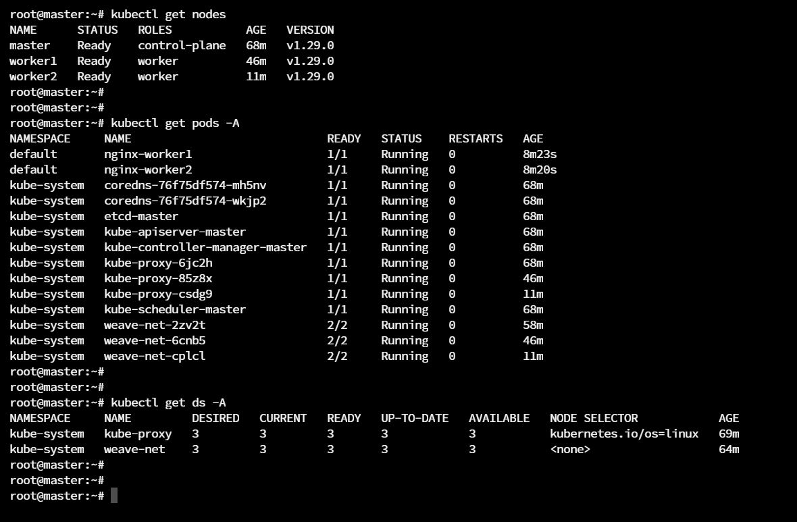

* Project Name: Multi-Node Kubernetes Cluster Provisioning
* Version: v1.0.0
* Organization Department: Technology

## Introduction

In this written guide, I documeneted my hands-on experience while deploying my own kuberentes cluster on three ubuntu servers running Ubuntu 20.04.6 LTS provided on the cloud by DigitalOcean.

**This guide consists of two primary sections:**

**1. Detailed Steps**

The "Detailed Steps" section provides comprehensive documentation of the procedures involved in deploying a Kubernetes cluster. It references and explains each step, making it particularly valuable for individuals creating their first Kubernetes cluster.

**2. Summary**

The "Summary" section, consisting of `Master Node Steps` and `Worker Node Steps` offers a concise documentation of the necessary actions to quickly establish and operate your Kubernetes cluster. This streamlined approach is intended to facilitate a quick and efficient setup process.

I recommend following the "Detailed Steps" for a thorough understanding of the deployment process, while the "Summary" section can be used as a quick reference guide for experienced users. I hope this documentation enhances your Kubernetes deployment experience.


<p align="right">(<a href="#readme-top">back to top</a>)</p>

## Detailed Steps

1. Open the <a href="https://kubernetes.io/docs/setup/production-environment/tools/kubeadm/install-kubeadm/#installing-runtime">documentation</a>:

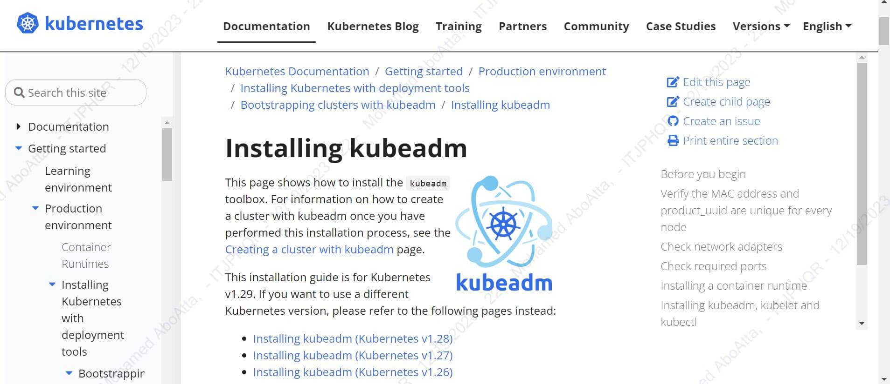

2. Following the documentation, we need to start by installing the <a href="https://kubernetes.io/docs/setup/production-environment/container-runtimes/">container runtime</a>

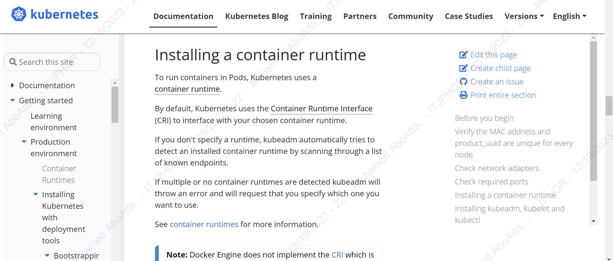

3. Regardless of the container runtime that we will use, when we navigate to <a href="https://kubernetes.io/docs/setup/production-environment/container-runtimes/">container runtime</a>, there are some commands that we need to execute on all of our nodes; to forward IPv4 and let iptables see bridged traffic :

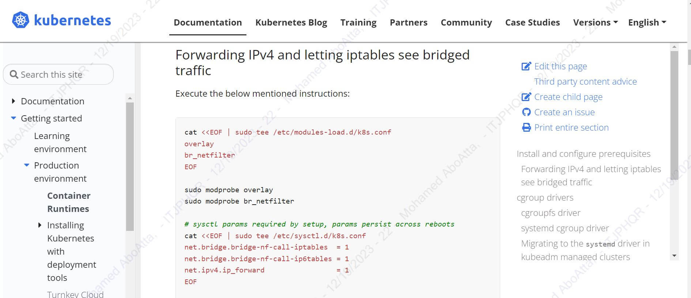

4. We also need to run some validation commands:

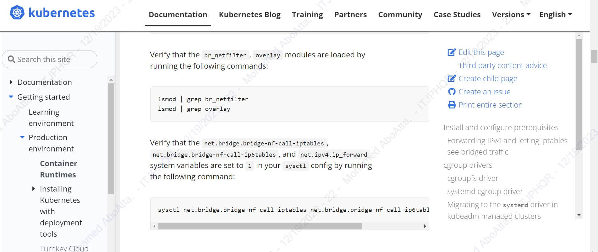

5. Let's go to the section of installing Containerd and click the <a href="https://github.com/containerd/containerd/blob/main/docs/getting-started.md">link in it</a>:

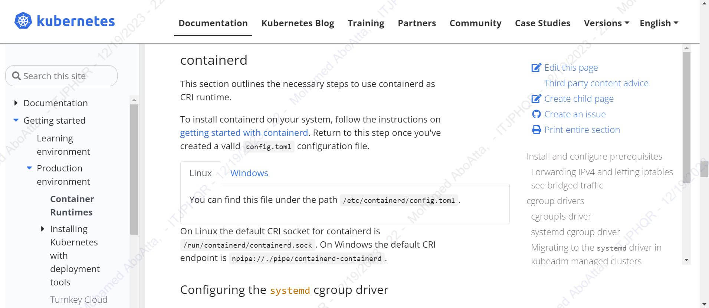

6. In the github repo that will open, we can choose how to install Containerd. Let's select Ubuntu:

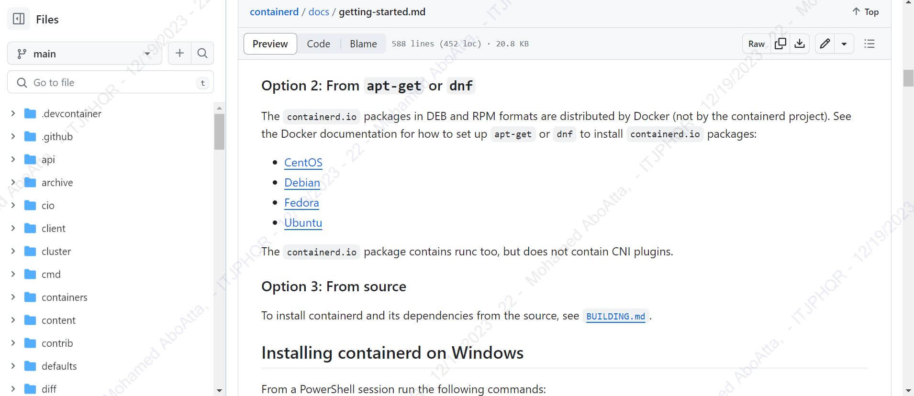

7. That will take us to the <a href="https://docs.docker.com/engine/install/ubuntu/">Docker installation page</a>. So, actually the process of installing Containerd is basically the same as installing Docker.

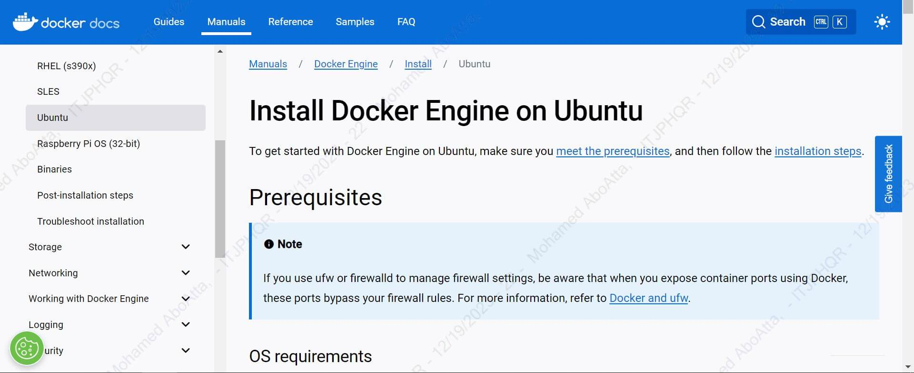

8. We follow all the steps on all of the 3 nodes except for the last step. We will install containerd.io only. No need to install Docker.

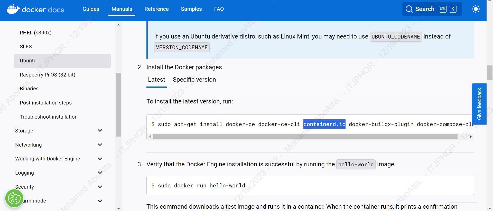

9. Back to <a href="https://kubernetes.io/docs/setup/production-environment/container-runtimes/">container runtime</a>, we need to take a look at the <a href="https://kubernetes.io/docs/setup/production-environment/container-runtimes/#cgroup-drivers">cgroup drivers</a> section. 
    * The **Control Groups** in Linux are used to constrain resources that are allocated to different processes running on the Linux machine. 
    * Both kubelet and the contrainer runtime need to interface with these control groups; to enforce various resource management for pods. 
    * Things like setting the CPU and memory requests and limits. These are all things that need to be communicated with the cgroups. 
    * So, for kubelet and container runtime to interact with cgroups, they need to use cgroup driver.
    * There are two different drivers for cgroups:
      * <a href="https://kubernetes.io/docs/setup/production-environment/container-runtimes/#cgroupfs-cgroup-driver">cgroupfs</a>: usually, this is the default one.
      * <a href="https://kubernetes.io/docs/setup/production-environment/container-runtimes/#systemd-cgroup-driver">systemd</a>
    * Which one to use is going to depend on a couple of different things, but the rule is: **if you are using a systemd init system, you have to use the systemd cgroup driver**.
    * In addition, whatever driver is being used, it must be the same one used by both kubelet and the container runtime.

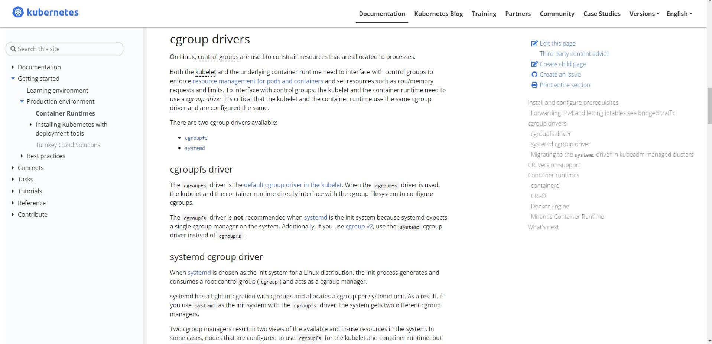

10. Let's verify if our system is using systemd or not to decide which driver we're going to use. We can do that by running `ps -p 1`. That simple get the running processes and filter on the process with ID 1; which is the init system of your server:

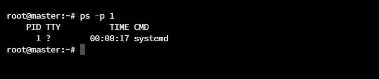

11. Since our system is using systemd, we have to use the systemd driver for cgroups. 
    * We go to the <a href="https://kubernetes.io/docs/setup/production-environment/container-runtimes/#containerd-systemd">Configuring the systemd cgroup driver</a> section. 
    * We need to set the config.toml as required. 
    * Note that, you need to delete all the default configurations that exist in the config.toml file. 
    * if you're using vim, you can simply open the file and type `:%d` then enter to delete all the content of the file. 
    * Then, put the config in the file as specified; but remember to delete the three-dots-line as well. 
    * Finally, for your changes to reflect, we need to restart the containerd service. 
    * Now, do that on all of our nodes.

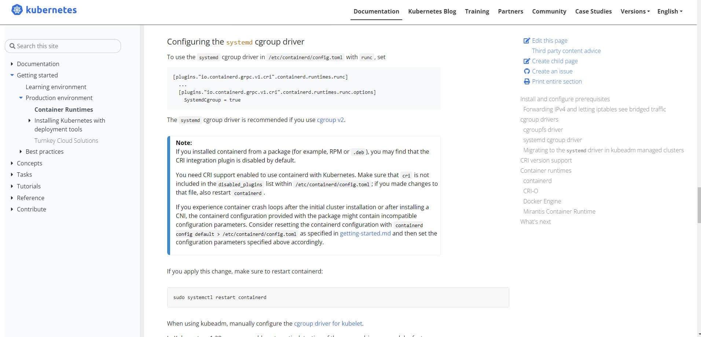

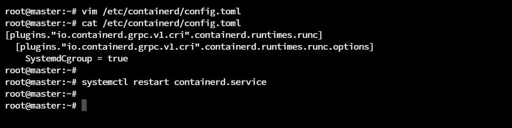

12. Back to the <a href="https://kubernetes.io/docs/setup/production-environment/tools/kubeadm/install-kubeadm/#installing-runtime">documentation</a>. Now that we installed the container runtime (containerd), we move on to the next step: <a href="https://kubernetes.io/docs/setup/production-environment/tools/kubeadm/install-kubeadm/#installing-kubeadm-kubelet-and-kubectl">Installing kubeadm, kubelet and kubectl</a>.
    *  We simply follow the listed instructions in the documentation.

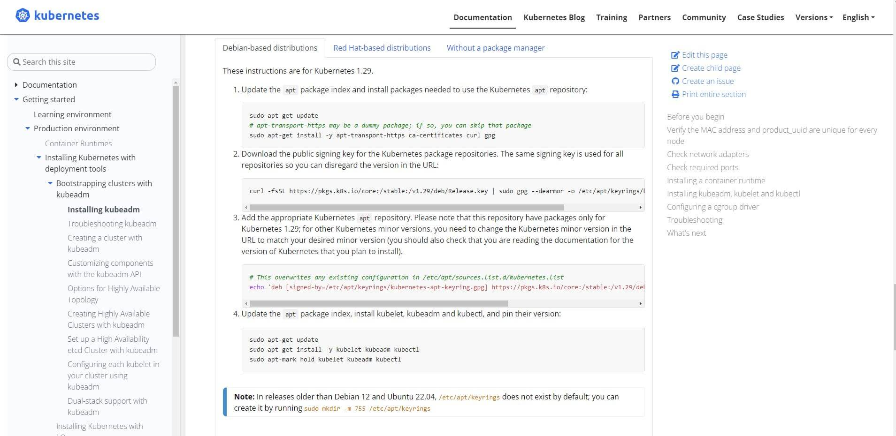


13. `ONLY ON THE MASTER NODE >>` Next, we move on to <a href="https://kubernetes.io/docs/setup/production-environment/tools/kubeadm/create-cluster-kubeadm/">Creating a cluster with kubeadm</a>.
    * The first step is related only to multiple master nodes cluster. So we're going to skip this point.
    * Second step, we have to choose a pod network add-on. Then, on top of that, when we run the `kubeadm init` command, which will create our cluster, we have to pass in the parameter `--pod-network-cidr` to provide what is going to be the pod network that're going to use. That is, any created pod will get an IP inside that range.
    * Third step is telling us that kubeadm will try to automatically detect which container runtime we're using. If it can't do that, we can pass in the flag `--cri-socket` and pass in the specific path to our container runtime. However, kubeadm will automatically detect that we're using containerd, so we don't have to worry about that step.
    * The last thing is that, when we run `kubeadm init` command, we're going to have to pass in the flag `--apiserver-advertise-address`. 
        * This is basically specify what is the address that the API server is going to listen on.
        * We're going to set it to be the correct static IP that we set on the master node, Which will make the API server accessible to all of the worker nodes on that IP.

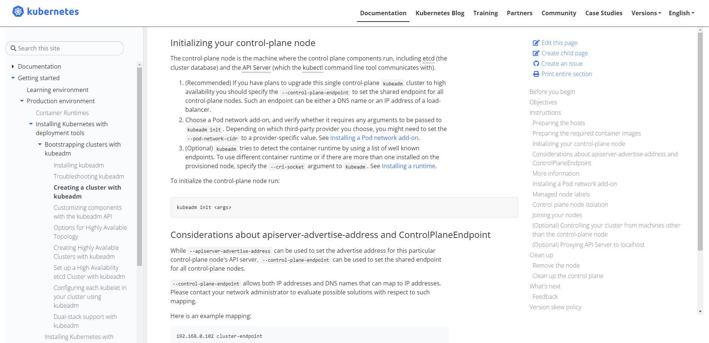

14. The kubeadm command so far should be as follows:

    * `kubeadm init --pod-network-cidr=10.244.0.0/16 --apiserver-advertise-address=157.230.12.200`

    * where `10.244.0.0/16` is a choosen network range and `157.230.12.200` is the IP address of the master node. 

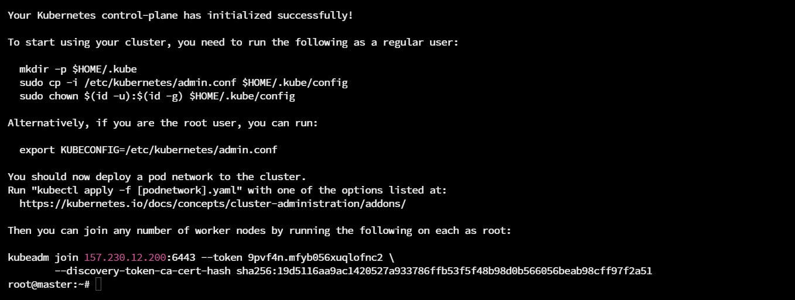

15. We've successfully initiated the cluster using kubeadm. At the end of installation, there are some steps left to complete the installation.
    * The first thing is `admin.conf` file was created; so we can use it to connect to our cluster.
    * So, we're going to create a `.kube` directory in our home directory, and we're going to copy that `admin.conf` file into that directory; so we can connect to our kubernetes cluster.
    * By running `kubectl get pods`, the `No resources found` means that we're connected to our cluster successfully but there are no deployed pods yet.

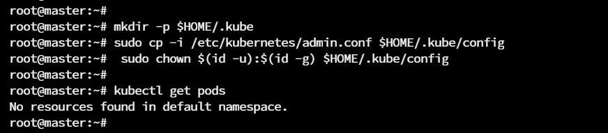

16. Next step as in the instruction.s, we now have to deploy our POD network. We follow that <a href="https://kubernetes.io/docs/concepts/cluster-administration/addons/">documentation link</a> in the terminal, then click on the last add-on <a href="https://www.weave.works/docs/net/latest/kubernetes/kube-addon/">Weave Net</a>

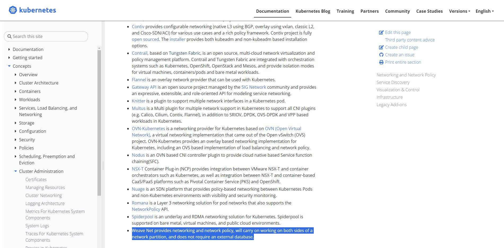

17. For installing Weave Net on a cluster, all we have to do is just run this command:
`$ kubectl apply -f https://github.com/weaveworks/weave/releases/download/v2.8.1/weave-daemonset-k8s.yaml`

    * Also, if we go down the page, we will see a warning telling us that if we use `--cluster-cidr` flag during kubeadm init command, we need to edit the the deployment of weave-net and set the variable `IPALLOC_RANGE` to the same network that we used in the kubeadm init command.


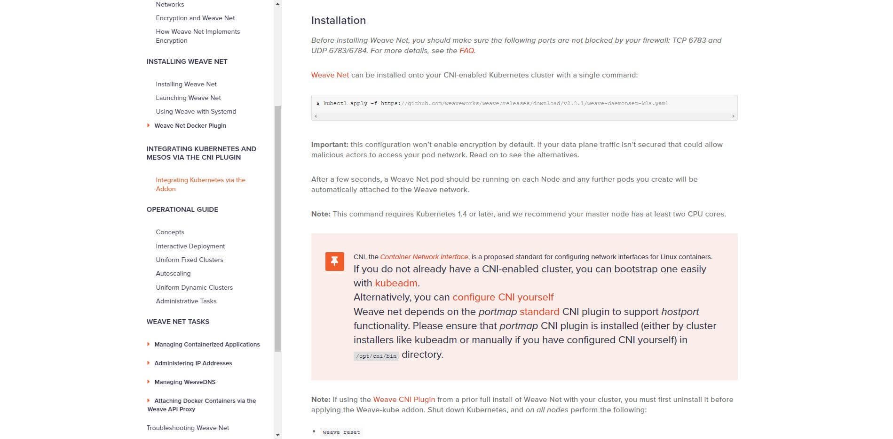


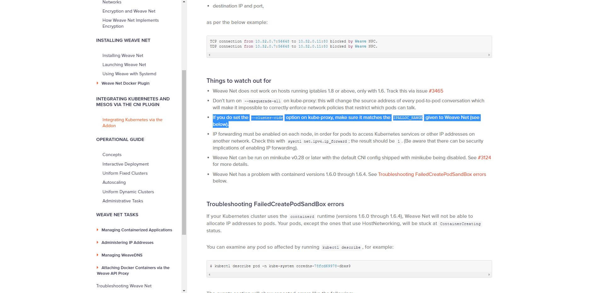


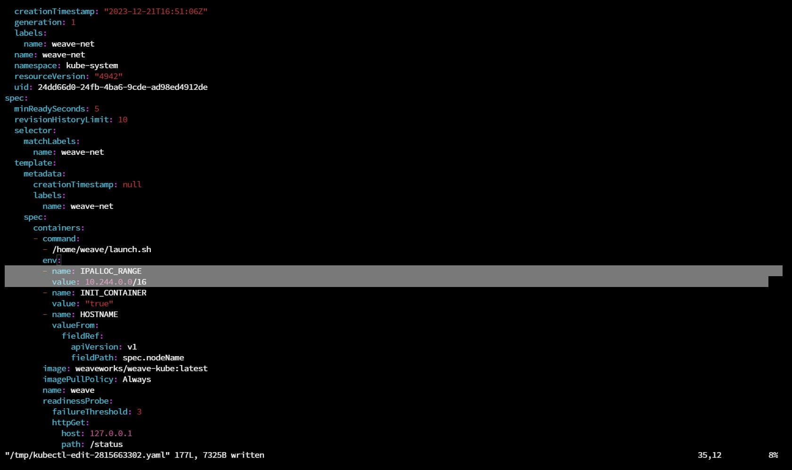

18. Finally, we need to run the `kubeadm join`, that was printed out before in the rest of installation steps, on both of the data nodes.

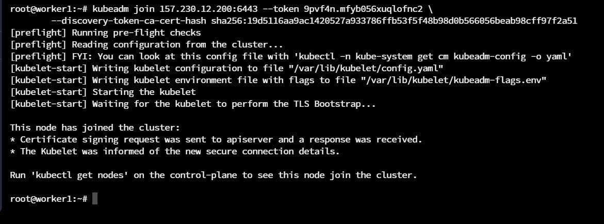
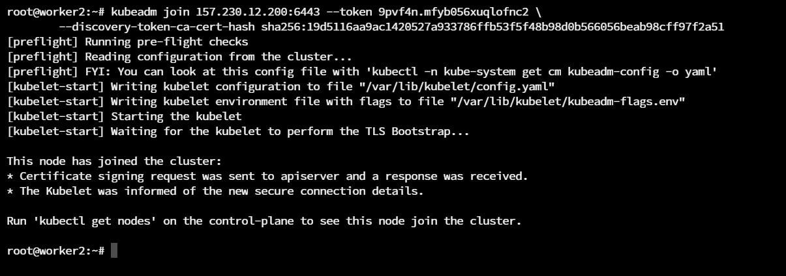


19. Optionally, we can define a role for the worker nodes using the following command: `kubectl label node node_name node-role.kubernetes.io/worker=worker`.

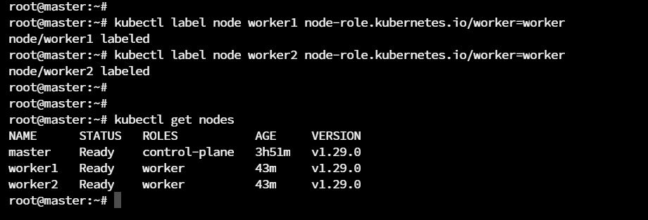

<p align="right">(<a href="#readme-top">back to top</a>)</p>

## Summary

### Master Node Steps
1. Installing container runtime
    * Forwarding IPv4 and letting iptables see bridged traffic
      ```
      cat <<EOF | sudo tee /etc/modules-load.d/k8s.conf
      overlay
      br_netfilter
      EOF

      sudo modprobe overlay
      sudo modprobe br_netfilter

      # sysctl params required by setup, params persist across reboots
      cat <<EOF | sudo tee /etc/sysctl.d/k8s.conf
      net.bridge.bridge-nf-call-iptables  = 1
      net.bridge.bridge-nf-call-ip6tables = 1
      net.ipv4.ip_forward                 = 1
      EOF

      # Apply sysctl params without reboot
      sudo sysctl --system
      ```

    * Install containerd
      ```
      for pkg in docker.io docker-doc docker-compose docker-compose-v2 podman-docker containerd runc; do sudo apt-get remove $pkg; done

      # Add Docker's official GPG key:
      sudo apt-get update
      sudo apt-get install ca-certificates curl gnupg
      sudo install -m 0755 -d /etc/apt/keyrings
      curl -fsSL https://download.docker.com/linux/ubuntu/gpg | sudo gpg --dearmor -o /etc/apt/keyrings/docker.gpg
      sudo chmod a+r /etc/apt/keyrings/docker.gpg

      # Add the repository to Apt sources:
      echo \
        "deb [arch=$(dpkg --print-architecture) signed-by=/etc/apt/keyrings/docker.gpg] https://download.docker.com/linux/ubuntu \
        $(. /etc/os-release && echo "$VERSION_CODENAME") stable" | \
        sudo tee /etc/apt/sources.list.d/docker.list > /dev/null
      sudo apt-get update
      sudo apt-get install containerd
      systemctl status containerd.service
      ```
    
    * Configuring the systemd cgroup driver in containerd configurations. Open `vim /etc/containerd/config.toml` then clear all the content using `:%d`, and finally add:

      <pre>
      [plugins."io.containerd.grpc.v1.cri".containerd.runtimes.runc]
      &nbsp;&nbsp;[plugins."io.containerd.grpc.v1.cri".containerd.runtimes.runc.options]
          SystemdCgroup = true
      </pre>

    * Restart containerd services for changes to reflect:
      ```
      systemctl restart containerd.service
      ```
2. Installing kubeadm, kubelet and kubectl

    * Run the following commands:
        ```
        sudo apt-get update
        # apt-transport-https may be a dummy package; if so, you can skip that package
        sudo apt-get install -y apt-transport-https ca-certificates curl gpg

        curl -fsSL https://pkgs.k8s.io/core:/stable:/v1.29/deb/Release.key | sudo gpg --dearmor -o /etc/apt/keyrings/kubernetes-apt-keyring.gpg

        # This overwrites any existing configuration in /etc/apt/sources.list.d/kubernetes.list
        echo 'deb [signed-by=/etc/apt/keyrings/kubernetes-apt-keyring.gpg] https://pkgs.k8s.io/core:/stable:/v1.29/deb/ /' | sudo tee /etc/apt/sources.list.d/kubernetes.list

        sudo apt-get update
        sudo apt-get install -y kubelet kubeadm kubectl
        sudo apt-mark hold kubelet kubeadm kubectl
        ```

3. Install cluster on the master node using kubeadm:

    * Run the below command and set the `--apiserver-advertise-address` flag to the master node IP:
        ```
        kubeadm init --pod-network-cidr=10.244.0.0/16 --apiserver-advertise-address=157.230.12.200
        ```

4. To start using your cluster, you need to run the following as a regular user:

    * Instructions:
        ```
        mkdir -p $HOME/.kube
        sudo cp -i /etc/kubernetes/admin.conf $HOME/.kube/config
        sudo chown $(id -u):$(id -g) $HOME/.kube/config
        ```
5. Deploy a pod network to the cluster:

    * Instructions:
        ```
        kubectl apply -f https://github.com/weaveworks/weave/releases/download/v2.8.1/weave-daemonset-k8s.yaml
        ```

    * Edit the the deployment of weave-net and set the variable IPALLOC_RANGE to the same network that we used in the kubeadm init command. Run:
        ```
        kubectl edit ds weave-net -n kube-system
        ```
    * Then add an environment variables to the container `weave`:
        ```
        - name: IPALLOC_RANGE
          value: 10.244.0.0/16
        ```
        

6. Run below command to test the status of the master node and deployed pods. The status of the master node should be `Ready` and the status of the deployed pods should be `Running`, all of them should be `Ready`, and no `Restarts`.

      * Instructions:
          ```
          kubectl get nodes
          watch kubectl get pods -A
          ```

<p align="right">(<a href="#readme-top">back to top</a>)</p>

### Worker Node Steps
1. Installing container runtime
    * Forwarding IPv4 and letting iptables see bridged traffic
      ```
      cat <<EOF | sudo tee /etc/modules-load.d/k8s.conf
      overlay
      br_netfilter
      EOF

      sudo modprobe overlay
      sudo modprobe br_netfilter

      # sysctl params required by setup, params persist across reboots
      cat <<EOF | sudo tee /etc/sysctl.d/k8s.conf
      net.bridge.bridge-nf-call-iptables  = 1
      net.bridge.bridge-nf-call-ip6tables = 1
      net.ipv4.ip_forward                 = 1
      EOF

      # Apply sysctl params without reboot
      sudo sysctl --system
      ```

    * Install containerd
      ```
      for pkg in docker.io docker-doc docker-compose docker-compose-v2 podman-docker containerd runc; do sudo apt-get remove $pkg; done

      # Add Docker's official GPG key:
      sudo apt-get update
      sudo apt-get install ca-certificates curl gnupg
      sudo install -m 0755 -d /etc/apt/keyrings
      curl -fsSL https://download.docker.com/linux/ubuntu/gpg | sudo gpg --dearmor -o /etc/apt/keyrings/docker.gpg
      sudo chmod a+r /etc/apt/keyrings/docker.gpg

      # Add the repository to Apt sources:
      echo \
        "deb [arch=$(dpkg --print-architecture) signed-by=/etc/apt/keyrings/docker.gpg] https://download.docker.com/linux/ubuntu \
        $(. /etc/os-release && echo "$VERSION_CODENAME") stable" | \
        sudo tee /etc/apt/sources.list.d/docker.list > /dev/null
      sudo apt-get update

      sudo apt-get install containerd.io

      systemctl status containerd.service
      ```
    
    * Configuring the systemd cgroup driver in containerd configurations. Open `vim /etc/containerd/config.toml` then clear all the content using `:%d`, and finally add:

      <pre>
      [plugins."io.containerd.grpc.v1.cri".containerd.runtimes.runc]
      &nbsp;&nbsp;[plugins."io.containerd.grpc.v1.cri".containerd.runtimes.runc.options]
          SystemdCgroup = true
      </pre>

    * Restart containerd services for changes to reflect:
      ```
      systemctl restart containerd.service
      ```
2. Installing kubeadm, kubelet and kubectl

    * Run the following commands:
        ```
        sudo apt-get update
        # apt-transport-https may be a dummy package; if so, you can skip that package
        sudo apt-get install -y apt-transport-https ca-certificates curl gpg

        curl -fsSL https://pkgs.k8s.io/core:/stable:/v1.29/deb/Release.key | sudo gpg --dearmor -o /etc/apt/keyrings/kubernetes-apt-keyring.gpg

        # This overwrites any existing configuration in /etc/apt/sources.list.d/kubernetes.list
        echo 'deb [signed-by=/etc/apt/keyrings/kubernetes-apt-keyring.gpg] https://pkgs.k8s.io/core:/stable:/v1.29/deb/ /' | sudo tee /etc/apt/sources.list.d/kubernetes.list

        sudo apt-get update
        sudo apt-get install -y kubelet kubeadm kubectl
        sudo apt-mark hold kubelet kubeadm kubectl
        ```
3. Join the cluster.

    * When you installed the cluster on the master node, a `kubeadm join` command was printed out with a token for worker nodes to join the cluster. Run this command on the worker nodes:

        ```
        kubeadm join 157.230.12.200:6443 --token 9sn7ve.bthlkjj36vq96xot \
        --discovery-token-ca-cert-hash YOUR-TOKEN-SHOULD-BE-HERE
        ```

4. On the master node, verify that the node was added to the cluster:

    * Run below command. The status of the new worker node should be `Ready`.
        ```
        kubectl get nodes
        ```

5. The new node will have a role of `<none>`. A node role is just a label with the format `node-role.kubernetes.io/<role>`. You can set the role of the new worker node using:
    ```
    kubectl label node node_name node-role.kubernetes.io/worker=worker
    ```

6. Run a test pod on the new worker node to make sure that everything is working as expected.
    * Create a `test_pod_worker1.yaml` file to deploy a test nginx pod to the new worker node `worker1`:
        ```
        apiVersion: v1
        kind: Pod
        metadata:
          name: nginx-worker1
        spec:
          containers:
          - name: nginx
            image: nginx
          affinity:
            nodeAffinity:
              requiredDuringSchedulingIgnoredDuringExecution:
                nodeSelectorTerms:
                - matchExpressions:
                  - key: kubernetes.io/hostname
                    operator: In
                    values:
                    - worker1
        ```
    
    * Then, apply the configuration to create the test pod on the new worker node `worker1`:
        ```
        kubectl apply -f test_pod_worker1.yaml
        ```

    * To get the pods running on specific node, run:
        ```
        kubectl get pods --field-selector spec.nodeName=worker1
        ```
    
7. To connect the kubectl utility on the worker node to the cluster, you need to copy the `~/.kube/config` file to your worker node on the same path.

    * On the master node, copy the configuration file content:
      ```
      cat ~/.kube/config
      ```
    * On the worker node, create the `.kube` directory then create the `config` file:
      ```
      mkdir -p ~/.kube/
      vim ~/.kube/config
      ```
    * By now, the kubectl utility should be connected to the cluster and you can verify that by running any test command, such as
      ```
      kubectl get nodes
      ```

<p align="right">(<a href="#readme-top">back to top</a>)</p>

## Enable Swap

By default, Kuberenetes doesn't allow using swap on its nodes. Starting from Kubernetes 1.28, a <a href="https://kubernetes.io/blog/2023/08/24/swap-linux-beta/">beta support for using swap on Linux</a> was added. 

I searched a lot but couldn't find a detailed guide to enable the swap. However, elhamdulillah, I could do it eventually. Here are the required steps:

1. Provision swap with selected size (in this example, 4G) on the required nodes. Add and execute the below bash script `vim create_swap.sh`:
```
#!/bin/bash

swapon --show
free -h
df -h
sudo fallocate -l 4G /swapfile
sudo ls -lh /swapfile
sudo chmod 600 /swapfile
sudo ls -lh /swapfile
sudo mkswap /swapfile
sudo swapon /swapfile
sudo swapon --show
free -h
sudo cp /etc/fstab /etc/fstab.bak
echo '/swapfile none swap sw 0 0' | sudo tee -a /etc/fstab

echo "Initial swappiness:"
cat /proc/sys/vm/swappiness
sudo sh -c "echo 'vm.swappiness=90' >> /etc/sysctl.conf"
sudo sysctl vm.swappiness=90
echo "Final swappiness:"
cat /proc/sys/vm/swappiness

echo "Initial cache pressure:"
cat /proc/sys/vm/vfs_cache_pressure
sudo sh -c "echo 'vm.vfs_cache_pressure=50' >> /etc/sysctl.conf"
sudo sysctl vm.vfs_cache_pressure=50
echo "Final cache pressure:"
cat /proc/sys/vm/vfs_cache_pressure
```

2. Enable swap in the kubelet configurations. 

    * First, open the configurations file of kubelet: 

      `vim /var/lib/kubelet/config.yaml`

    * Add the below lines at the end of the file:

      ```
      failSwapOn: false
      featureGates:
        NodeSwap: true
      memorySwap:
        swapBehavior: LimitedSwap
      ```

    * Restart systemd daemon and the kubelet service:

      ```
      systemctl daemon-reload ; systemctl restart kubelet.service
      ```

    * Check the status of the kubelet service; it should be active and running now:

      ```
      systemctl status kubelet.service
      ```

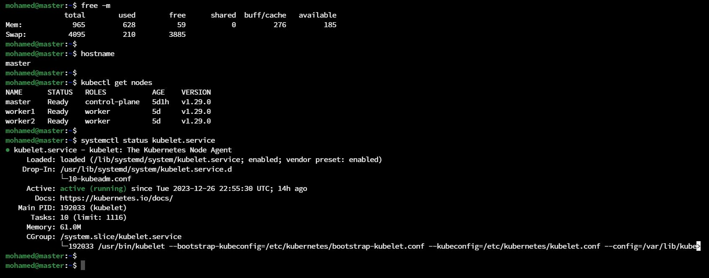


<p align="right">(<a href="#readme-top">back to top</a>)</p>

## Expected Issues

1. At any point, if you feel that you want to reset the installation process, run `kubeadm reset` and follow the steps printed out at the end of the execution.

2. If the master node is below minimum requirements, the `kubeadm init` command will fail. So, we need to tell it to ignore the validation by using two more parameters: `--ignore-preflight-errors=NumCPU  --ignore-preflight-errors=Mem`. However, it's vital to know that if the master node is below 2G of Ram, you will most likely face serverl issues and the cluster won't operate as expected.

    * The Final kubeadm command should be: `kubeadm init --pod-network-cidr=10.244.0.0/16 --apiserver-advertise-address=157.230.12.200 --ignore-preflight-errors=NumCPU  --ignore-preflight-errors=Mem`

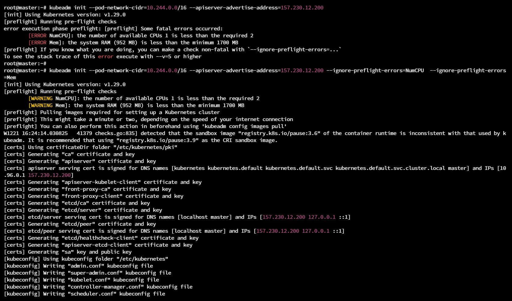

<p align="right">(<a href="#readme-top">back to top</a>)</p>

<!-- CONTACT -->
## Contact

Mohamed AbdelGawad Ibrahim - [@m-abdelgawad](https://www.linkedin.com/in/m-abdelgawad/) - <a href="tel:+201069052620">+201069052620</a>

<p align="right">(<a href="#readme-top">back to top</a>)</p>

## References

* https://kubernetes.io/docs/setup/production-environment/tools/kubeadm/create-cluster-kubeadm/
* https://stackoverflow.com/questions/60804280/kubadm-init-error-cpus-1-is-less-than-required-2
* https://discuss.kubernetes.io/t/kubeadm-init-validation-error/11706
* https://github.com/kubernetes/kubeadm/issues/2767
* https://stackoverflow.com/questions/63367988/kubernetes-worker-node-is-notready-due-to-cni-plugin-not-initialized
* https://stackoverflow.com/questions/48854905/how-to-add-roles-to-nodes-in-kubernetes


<p align="right">(<a href="#readme-top">back to top</a>)</p>

<!-- MARKDOWN LINKS & IMAGES -->
<!-- https://www.markdownguide.org/basic-syntax/#reference-style-links -->
[linkedin-shield]: https://img.shields.io/badge/-LinkedIn-black.svg?style=for-the-badge&logo=linkedin&colorB=555
[linkedin-url]: https://www.linkedin.com/in/m-abdelgawad/
