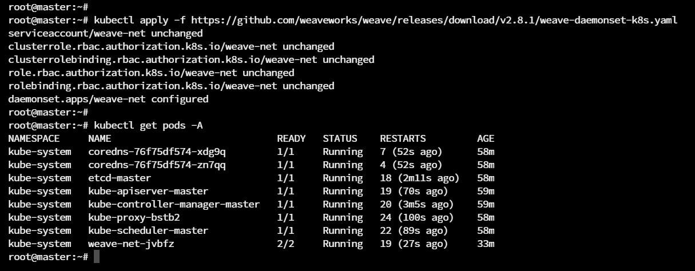
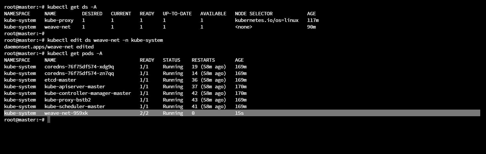
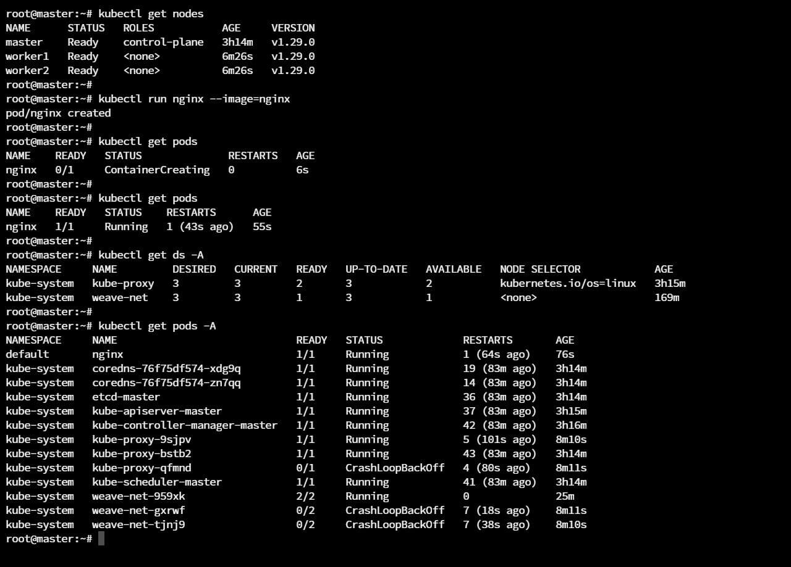
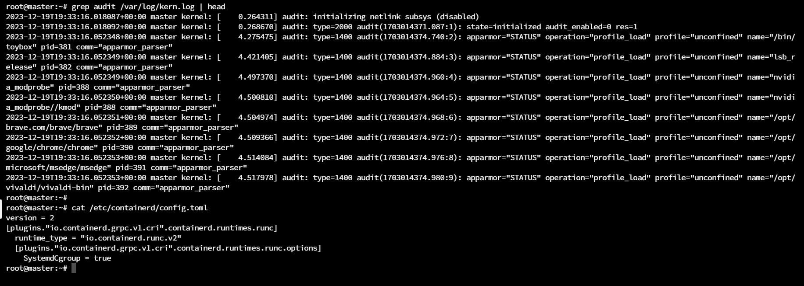

<a name="readme-top"></a>

[![LinkedIn][linkedin-shield]][linkedin-url]


<!-- PROJECT LOGO -->
<br />
<div align="center">
  
  <h3 align="center">Multi-Node Kubernetes Cluster Provisioning</h3>
</div>


<!-- TABLE OF CONTENTS -->
<details>
  <summary>Table of Contents</summary>
  <ol>
    <li>
      <a href="#about-the-project">About The Project</a>
      <ul>
        <li><a href="#steps">Steps</a></li>
        <li><a href="#expected-issues">Expected Issues</a></li>
      </ul>
    </li>
    <li><a href="#contact">Contact</a></li>
    <li><a href="#references">References</a></li>
  </ol>
</details>


<!-- ABOUT THE PROJECT -->
## About The Project


* Project Name: Multi-Node Kubernetes Cluster Provisioning
* Version: v1.0.0
* Organization Department: Technology


### Steps

1. Open the <a href="https://kubernetes.io/docs/setup/production-environment/tools/kubeadm/install-kubeadm/#installing-runtime">documentation</a>:


2. Following the documentation, we need to start by installing the <a href="https://kubernetes.io/docs/setup/production-environment/container-runtimes/">container runtime</a>


3. Regardless of the container runtime that we will use, when we navigate to <a href="https://kubernetes.io/docs/setup/production-environment/container-runtimes/">container runtime</a>, there are some commands that we need to execute on all of our nodes; to forward IPv4 and let iptables see bridged traffic :


4. We also need to run some validation commands:


5. Let's go to the section of installing Containerd and click the <a href="https://github.com/containerd/containerd/blob/main/docs/getting-started.md">link in it</a>:


6. In the github repo that will open, we can choose how to install Containerd. Let's select Ubuntu:


7. That will take us to the <a href="https://docs.docker.com/engine/install/ubuntu/">Docker installation page</a>. So, actually the process of installing Containerd is basically the same as installing Docker.


8. We follow all the steps on all of the 3 nodes except for the last step. We will install containerd.io only. No need to install Docker.


9. Back to <a href="https://kubernetes.io/docs/setup/production-environment/container-runtimes/">container runtime</a>, we need to take a look at the <a href="https://kubernetes.io/docs/setup/production-environment/container-runtimes/#cgroup-drivers">cgroup drivers</a> section. 
    * The **Control Groups** in Linux are used to constrain resources that are allocated to different processes running on the Linux machine. 
    * Both kubelet and the contrainer runtime need to interface with these control groups; to enforce various resource management for pods. 
    * Things like setting the CPU and memory requests and limits. These are all things that need to be communicated with the cgroups. 
    * So, for kubelet and container runtime to interact with cgroups, they need to use cgroup driver.
    * There are two different drivers for cgroups:
      * <a href="https://kubernetes.io/docs/setup/production-environment/container-runtimes/#cgroupfs-cgroup-driver">cgroupfs</a>: usually, this is the default one.
      * <a href="https://kubernetes.io/docs/setup/production-environment/container-runtimes/#systemd-cgroup-driver">systemd</a>
    * Which one to use is going to depend on a couple of different things, but the rule is: **if you are using a systemd init system, you have to use the systemd cgroup driver**.
    * In addition, whatever driver is being used, it must be the same one used by both kubelet and the container runtime.


10. Let's verify if our system is using systemd or not to decide which driver we're going to use. We can do that by running `ps -p 1`. That simple get the running processes and filter on the process with ID 1; which is the init system of your server:


11. Since our system is using systemd, we have to use the systemd driver for cgroups. 
    * We go to the <a href="https://kubernetes.io/docs/setup/production-environment/container-runtimes/#containerd-systemd">Configuring the systemd cgroup driver</a> section. 
    * We need to set the config.toml as required. 
    * Note that, you need to delete all the default configurations that exist in the config.toml file. 
    * if you're using vim, you can simply open the file and type `:%d` then enter to delete all the content of the file. 
    * Then, put the config in the file as specified; but remember to delete the three-dots-line as well. 
    * Finally, for your changes to reflect, we need to restart the containerd service. 
    * Now, do that on all of our nodes.


12. Back to the <a href="https://kubernetes.io/docs/setup/production-environment/tools/kubeadm/install-kubeadm/#installing-runtime">documentation</a>. Now that we installed the container runtime (containerd), we move on to the next step: <a href="https://kubernetes.io/docs/setup/production-environment/tools/kubeadm/install-kubeadm/#installing-kubeadm-kubelet-and-kubectl">Installing kubeadm, kubelet and kubectl</a>.
    *  We simply follow the listed instructions in the documentation.


13. `ONLY ON THE MASTER NODE >>` Next, we move on to <a href="https://kubernetes.io/docs/setup/production-environment/tools/kubeadm/create-cluster-kubeadm/">Creating a cluster with kubeadm</a>.
    * The first step is related only to multiple master nodes cluster. So we're going to skip this point.
    * Second step, we have to choose a pod network add-on. Then, on top of that, when we run the `kubeadm init` command, which will create our cluster, we have to pass in the parameter `--pod-network-cidr` to provide what is going to be the pod network that're going to use. That is, any created pod will get an IP inside that range.
    * Third step is telling us that kubeadm will try to automatically detect which container runtime we're using. If it can't do that, we can pass in the flag `--cri-socket` and pass in the specific path to our container runtime. However, kubeadm will automatically detect that we're using containerd, so we don't have to worry about that step.
    * The last thing is that, when we run `kubeadm init` command, we're going to have to pass in the flag `--apiserver-advertise-address`. 
        * This is basically specify what is the address that the API server is going to listen on.
        * We're going to set it to be the correct static IP that we set on the master node, Which will make the API server accessible to all of the worker nodes on that IP.


14. The kubeadm command so far should be as follows:

    * `kubeadm init --pod-network-cidr=10.244.0.0/16 --apiserver-advertise-address=157.230.12.200`

    * where `10.244.0.0/16` is a choosen network range and `157.230.12.200` is the IP address of the master node. 

    * Since I am using a master node with only 1 CPU and 1GB memory. The `kubeadm init` command will fail. So, we need to tell it to ignore the validation by using two more parameters: `--ignore-preflight-errors=NumCPU  --ignore-preflight-errors=Mem`

    * The Final kubeadm command should be: `kubeadm init --pod-network-cidr=10.244.0.0/16 --apiserver-advertise-address=157.230.12.200 --ignore-preflight-errors=NumCPU  --ignore-preflight-errors=Mem`


15. We've successfully initiated the cluster using kubeadm. At the end of installation, there are some steps left to complete the installation.
    * The first thing is `admin.conf` file was created; so we can use it to connect to our cluster.
    * So, we're going to create a `.kube` directory in our home directory, and we're going to copy that `admin.conf` file into that directory; so we can connect to our kubernetes cluster.
    * By running `kubectl get pods`, the `No resources found` means that we're connected to our cluster successfully but there are no deployed pods yet.


16. Next step as in the instruction.s, we now have to deploy our POD network. We follow that <a href="https://kubernetes.io/docs/concepts/cluster-administration/addons/">documentation link</a> in the terminal, then click on the last add-on <a href="https://www.weave.works/docs/net/latest/kubernetes/kube-addon/">Weave Net</a>


17. For installing Weave Net on a cluster, all we have to do is just run this command:
`$ kubectl apply -f https://github.com/weaveworks/weave/releases/download/v2.8.1/weave-daemonset-k8s.yaml`

    * Also, if we go down the page, we will see a warning telling us that if we use `--cluster-cidr` flag during kubeadm init command, we need to edit the the deployment of weave-net and set the variable `IPALLOC_RANGE` to the same network that we used in the kubeadm init command.








18. Finally, we need to run the `kubeadm join`, that was printed out before in the rest of installation steps, on both of the data nodes.




19. Optionally, we can define a role for the worker nodes using the following command: `kubectl label node node_name node-role.kubernetes.io/worker=worker`.


### Expected Issues

1. When I executed any kubectl command, I get the below error: `dial tcp 157.230.12.200:6443: connect: connection refused`. 

    * After investigating the issue, it turned out to be related to AppArmor. 
    * To determine that, we can run `grep audit /var/log/kern.log`.
    * After searching, I found out that I should modify the `/etc/containerd/config.toml` to the below config. Then restart containerd, apparmor and kubelet.

```
version = 2
[plugins."io.containerd.grpc.v1.cri".containerd.runtimes.runc]
  runtime_type = "io.containerd.runc.v2"
  [plugins."io.containerd.grpc.v1.cri".containerd.runtimes.runc.options]
    SystemdCgroup = true
```



2. At any point, if you feel that you want to reset the installation process, run `kubeadm reset` and follow the steps printed out at the end of the execution.


<p align="right">(<a href="#readme-top">back to top</a>)</p>

<!-- CONTACT -->
## Contact

Mohamed AbdelGawad Ibrahim - [@m-abdelgawad](https://www.linkedin.com/in/m-abdelgawad/) - <a href="tel:+201069052620">+201069052620</a>

<p align="right">(<a href="#readme-top">back to top</a>)</p>

## References

* https://kubernetes.io/docs/setup/production-environment/tools/kubeadm/create-cluster-kubeadm/
* https://stackoverflow.com/questions/60804280/kubadm-init-error-cpus-1-is-less-than-required-2
* https://discuss.kubernetes.io/t/kubeadm-init-validation-error/11706
* https://github.com/kubernetes/kubeadm/issues/2767
* https://stackoverflow.com/questions/63367988/kubernetes-worker-node-is-notready-due-to-cni-plugin-not-initialized
* https://stackoverflow.com/questions/48854905/how-to-add-roles-to-nodes-in-kubernetes


<p align="right">(<a href="#readme-top">back to top</a>)</p>

<!-- MARKDOWN LINKS & IMAGES -->
<!-- https://www.markdownguide.org/basic-syntax/#reference-style-links -->
[linkedin-shield]: https://img.shields.io/badge/-LinkedIn-black.svg?style=for-the-badge&logo=linkedin&colorB=555
[linkedin-url]: https://www.linkedin.com/in/m-abdelgawad/
